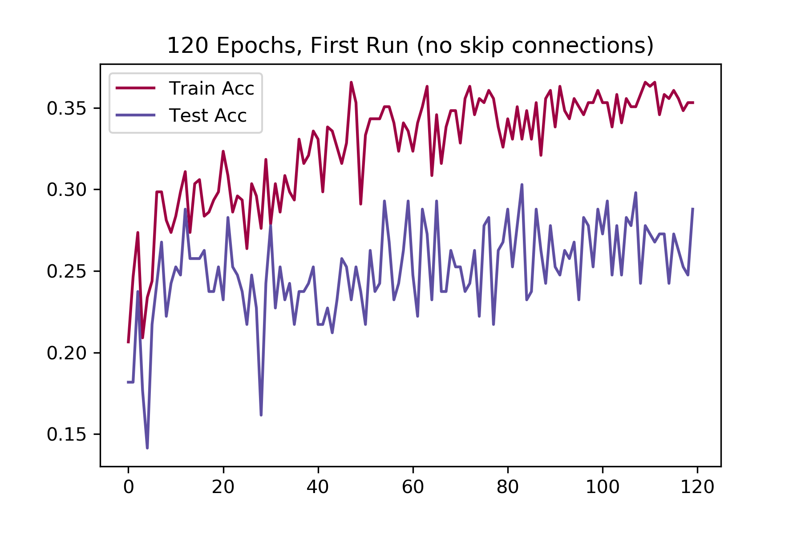
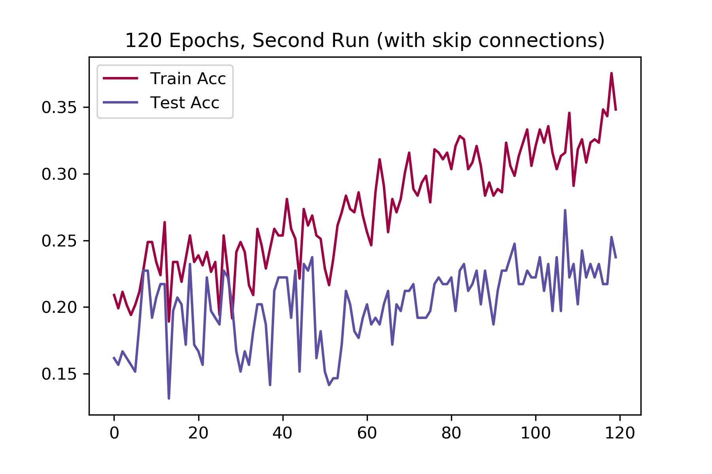

# GNN-based-diag
A repository for the 02-740 Bioimage Informatics course project on GNN-based cancer detection and classification.

- WIP: https://drive.google.com/file/d/18EfaqRfm8PwYN7Vg5b_r0sqqOF8FZt5o/view?usp=sharing

- Pipeline:
    - Images --> Node/Edge list --> Graphical Embedding (Pytorch Geometric/Node2Vec) -> GNN/Sk-learn Classifiers

## Initial Results:
- We use RGB values on truncated portions of this dataset (https://www.kaggle.com/andrewmvd/malignant-lymphoma-classification) as node labels.
- Euclidean pairwise distances are used as edge labels.
- Graph is fully connected.
- All of the above are good targets for improvement.

- 120 epochs with a baseline GCN:

- 120 epochs with a resnet-style skip connection GCN:

## Future Work:
- Use a dataset with more heterogeneous classes with respect to nodes.
- Tweak the model archicture.
